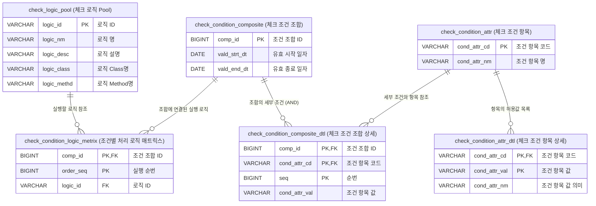
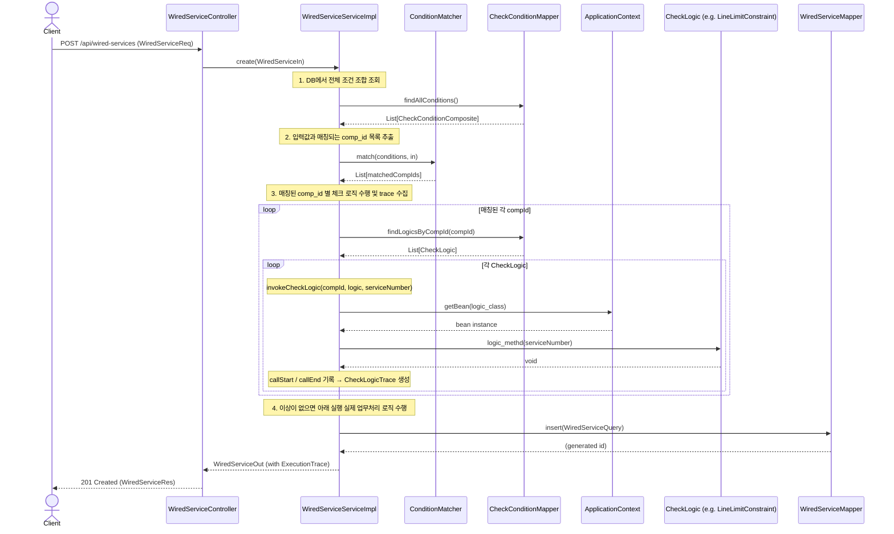

# DB접속 확인
http://localhost:8080/h2-console
jdbc:h2:file:./src/main/resources/db/testdb

# 테이블 구조


## 동적 조건 체크 쿼리
```sql
SELECT
    comp_id,
    cond_attr_cd,
    LISTAGG(cond_attr_val, ',') WITHIN GROUP (ORDER BY seq) AS cond_attr_val
FROM CHECK_CONDITION_COMPOSITE_DTL
GROUP BY comp_id, cond_attr_cd;

```

## 쿼리 결과

| COMP_ID | COND_ATTR_CD | COND_ATTR_VAL|
| --- | --- | --- |
| 1 | svc_cd | C |
| 2 | chg_cd | A1 |
| 2 | svc_cd | I |
| 3 | chg_cd | C8,C6 |
| 3 | svc_cd | C |
| 3 | svc_use_ctg | 01 |


## 체크로직 수행 정보 확인 쿼리
```sql
SELECT
    clp.logic_id,
    clp.logic_desc,
    clp.logic_class,
    clp.logic_methd
FROM check_condition_logic_metrix cclm
INNER JOIN check_logic_pool clp ON cclm.logic_id = clp.logic_id
WHERE cclm.comp_id = 3
ORDER BY cclm.order_seq
```

## 쿼리 결과

| LOGIC_ID  |	LOGIC_DESC  |	LOGIC_CLASS  |	LOGIC_METHD  |
| --- | --- | --- | --- |
| 2000000831  |	SKB미납금존재  |	BillingHistoryConstraint  |	checkUnpaidBalance  |
| 2000001922  |	3개월내해지가입제한  |	SubscrpTermConstraint  |	checkReSubscriptionWithinThreeMonths  |
| 2000002723  |	신용가입제한체크  |	LineLimitConstraint  |	checkCreditSubscriptionRestriction  |
| 2000003023  |	동일장소인터넷tv 제한  |	SubscrpAgencyConstraint  |	checkSameLocationInternetTvRestriction  |


## 동적 호출 구조
